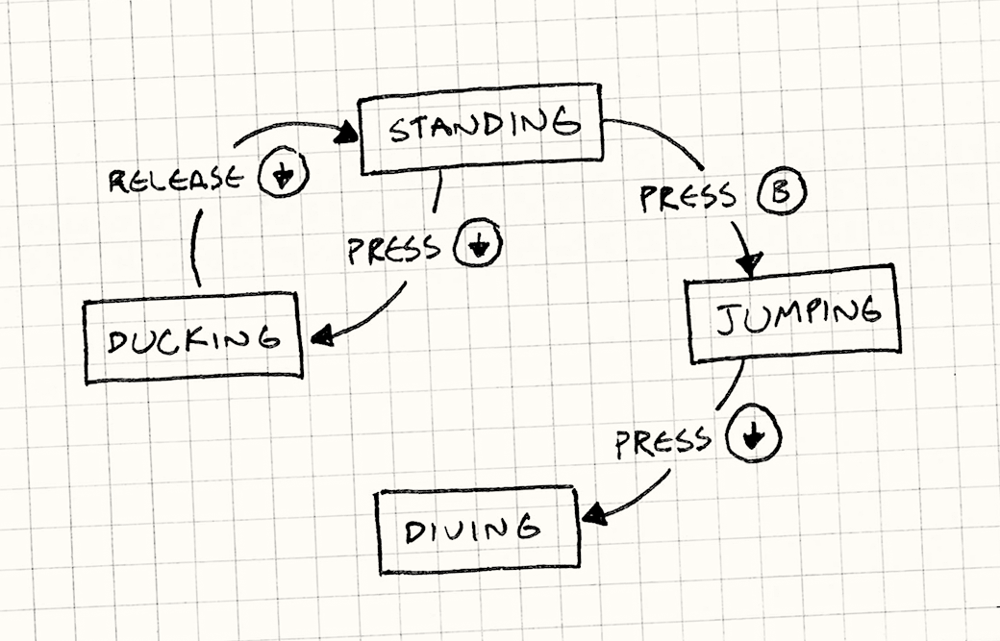
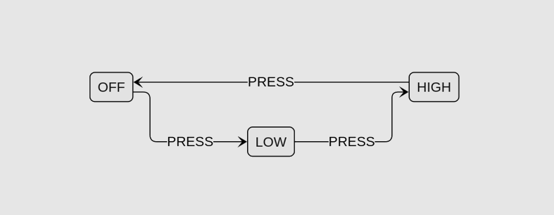

# Our Philoshopy #

In `little-fsm`, the shape of context matters. A lot.

Many state machine libraries treat context as a collection of mutable values carried along with each transition. `little-fsm` takes a more structured approach.

Before we dive into what context really means, let’s revisit the basics.

### First, what is a finite state machine?

A finite state machine specifies a system's behavior using a finite number of states, events and transitions. 

Events triggered the transitions between states, changing how the system behaves.

The image below shows how we can model the behavior of a game character based on button press events.

### What is context?

Some state machines need context, while others don’t.
Let’s look at a few examples.

---

### Example: The Ballpoint Pen — Two States, No Context

States
- IN → Pen tip is in
- OUT → Pen tip is out 

This is an example where only the states matter, and there’s no extra data to keep track of.

### Example: Hair Dryer — Three States, Single Context

Imagine a hair dryer with a single button that cycles through:
- OFF → hair dryer is off
- LOW → low heat / low speed
- HIGH → high heat / high speed

While the states alone describe the mode of operation, we often need additional details that define how the state behaves.

In this example, the state of a hair dryer would affect the fan speed and the heat values. That’s something you can’t express with state transitions alone.

That fan speed and heat are not states, but rather *quantitative details* associated with the current state.

| State | Context|
|------|-------------------------|
| OFF  | `{ heat:number, speed:number }` |
| LOW  | `{ heat:number, speed:number }` |
| HIGH | `{ heat:number, speed:number }` |

Note that all states share the same context shape: `{ heat: number, speed: number }`. While this makes perfect sense for this particular example, you’ll see later that using the same context shape is not ideal in other scenarios. Some states may need its own distinct context shape.

---

### Example: File Upload — Two States, Different Contexts

States:
- `IDLE` — no file selected
- `UPLOADING` — currently uploading a file

Events:
- `STARTED` — Upload has started
- `COMPLETED` — Upload has completed

For `UPLOADING` state, we need the context value `fileName`. However, it is not needed for `IDEA` state.

Let's look at the state to context associations.

| State | Context |
|-----|-------------------------|
| IDLE | ~~`{fileName: string}`~~ |
| UPLOADING  | `{fileName: string}` |

Here, the context value `fileName` makes no sense while `IDLE`. We are better off using different context shapes for the states.

| State | Context |
|-----|-------------------------|
| IDLE | `{}` |
| UPLOADING  | `{fileName: string}` |

---

### The shape of context matters.

Many state machine libraries treat context as a collection of mutable values carried along with each transition.

`little-fsm` takes a more structured approach: the shape of context matters and evolves with the state.
- Each state can have its own context shape
- Multiple states can share a context shape
- Context is not uniform — it depends on the current state

### Why this design is selected?
- Each state carries only the data it needs. No big global context.
- You can safely model transitions that change both the control state and the data shape.

In a finite state machine, states define behavior but context qualifies the state and makes it meaningful.

`little-fsm` treats context as a first-class citizen: not all states share the same context shape.

### What's next?

In the next section, we will deep dive into implmenting the above examples using `little-fsm`.

1. [Ball-point Pen example](./examples/ballpoint-pen.md) 
2. [Hair Dryer example](./examples/hair-dryer.md) 
2. [File Upload example](./examples/file-upload.md) 